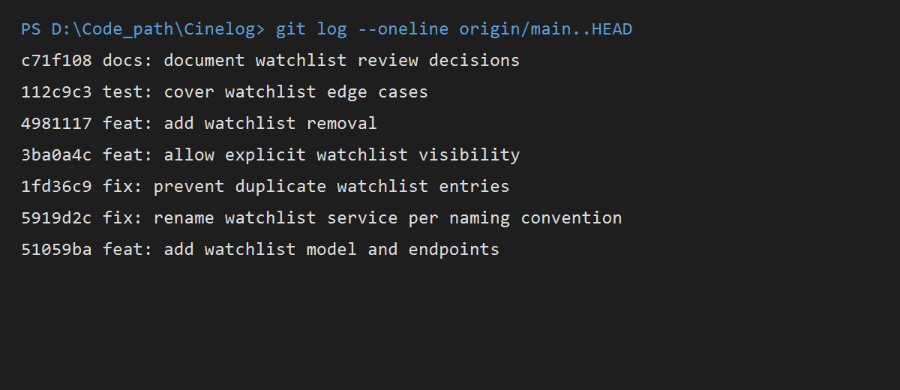

# PR Response Doc — CineLog Watchlist Feature

## AI Usage

I used AI to help me get oriented in the repo and to compare the watchlist code with `add_to_collection()`. I also asked it to point out weaknesses in my answers for Comments 4 and 5. It brought up the privacy risk of a public default and the fact that some people use a watchlist like a queue. I added both points below, but made the final choices based on how CineLog currently works. I checked the code myself and ran the tests after every round of changes.

## Comment 1 — Rename

**What I did:** I renamed `save_to_watchlist()` to `add_to_watchlist()`. I also changed the import and function call in `routes/watchlist/watchlist.py`. The new name matches functions such as `add_to_collection()`.

**How I verified:** I searched the whole repo for `save_to_watchlist`. The only match left is this explanation. I also ran the test suite.

## Comment 2 — Deduplication

**What I did:** Before creating a watchlist entry, the service now checks for the same `user_id` and `film_id`. If it finds one, it raises `AlreadyInWatchlistError`. I followed the pattern in `add_to_collection()`. I also added a unique constraint to the model as a second layer of protection.

**How I verified:** I added a test that calls `add_to_watchlist()` twice with the same user and film. The second call must raise the error, and the database must still contain only one entry.

## Comment 3 — Missing test

**What I did:** I added `test_add_to_watchlist_nonexistent_film_raises`. It uses a valid-looking UUID that is not in the test database and checks for `FilmNotFoundError`.

**How I verified:** I used the nonexistent-film collection test as my example. I ran `pytest tests/test_watchlist.py -v`, followed by `pytest tests/ -v`.

## Comment 4 — Default visibility

**My position:** I kept `public=True`, but callers can now pass `public: false` when adding a film.

**Reasoning:** CineLog is a community film app, so sharing lists makes sense as the default behavior. Keeping the default also avoids changing the behavior of existing requests. Adding the optional parameter means a client can still offer a private choice.

**Tradeoff acknowledged:** Public by default is less private. Someone might add a film without realizing other users can see it. If CineLog gets a frontend, the visibility setting should be shown clearly instead of being hidden from the user.

## Comment 5 — Sort order

**My position:** I kept alphabetical ordering.

**Reasoning:** I see the watchlist as a list of choices rather than a history page. Alphabetical order makes it easier to find a film by name and stays predictable as more films are added. The collection is different because newest-first is useful when looking back at recently watched films.

**Engagement with reviewer's point:** I understand why newest-first would be useful. It would work better for someone treating the watchlist as a queue, and it puts recent interests at the top. If sorting options are added later, newest-first should be one of them. For the current endpoint, I chose the more stable alphabetical order.

## Comment 6 — Rebase

**What conflicted:** `main` changed film IDs from integers to UUID strings. The watchlist branch was created before that change and its model still used an integer film ID.

**How I resolved it:** I rebased onto `main`, kept the UUID version of `Film`, and changed `WatchlistEntry.film_id` to `db.String(36)`. I also updated the watchlist type descriptions and tests to use UUIDs.

**How I verified no conflict remains:** I ran all tests, checked for conflict markers, ran `git diff --check`, and checked that there are no merge commits on the feature branch.

## Final Commit History

I split the work into separate commits for the rename, duplicate handling, stretch features, tests, and documentation.

## Stretch Features

- I added `remove_from_watchlist()` and a matching DELETE endpoint. The removal test confirms the entry is gone afterward.
- I added a duplicate-entry test because repeated clicks or requests should not create extra rows.
- I added an optional `public` value to the add endpoint and tested that `false` is stored correctly.

## PR Description

This PR adds watchlists to CineLog. A user can add a film, view saved films in alphabetical order, choose whether an entry is public, and remove a film later. The service also rejects missing films and duplicate entries.

I kept watchlists public by default because CineLog is community-focused, while still allowing a caller to choose private visibility. I also kept alphabetical sorting because it makes a saved film easier to find. The collection remains newest-first because it represents viewing history.

### Manual testing

1. Start the app with `python app.py` and create a user and film in the database.
2. Send `POST /watchlist/<user_id>/add` with `{"film_id": "<film-uuid>", "public": false}`.
3. Send `GET /watchlist/<user_id>` and check that the film appears with `public` set to `false`.
4. Repeat the POST and confirm that a duplicate is rejected.
5. Send `DELETE /watchlist/<user_id>/remove` with `{"film_id": "<film-uuid>"}`.
6. Send the GET request again and confirm that the film is no longer present.
7. Run `pytest tests/ -v` to run the automated tests.
